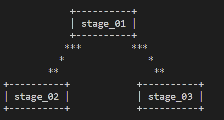

# project setup steps:

1. create conda -p env python==3.8 -y  && source ./venv
2. conda activate /env 
3. pip install -r requirements.txt 

## dvc commands:
1. dvc init 
2. dvc repro (it is used to track the yaml file )
3. dvc dag(to maintain acyclic graph between two stages)

4. dvc add folder name/(this is used to track the csv file )

5. mkdir tmp (created temp folder inside tmp create dvcstore folder ) 

6. mkdir dvcstore(create this folder)

7. dvc remote add -d myremote /tmp/dvcstore (here i have added the in tmp/dvcstore folder remotely )

8. dvc push (to push changes into dvcstore folder )
